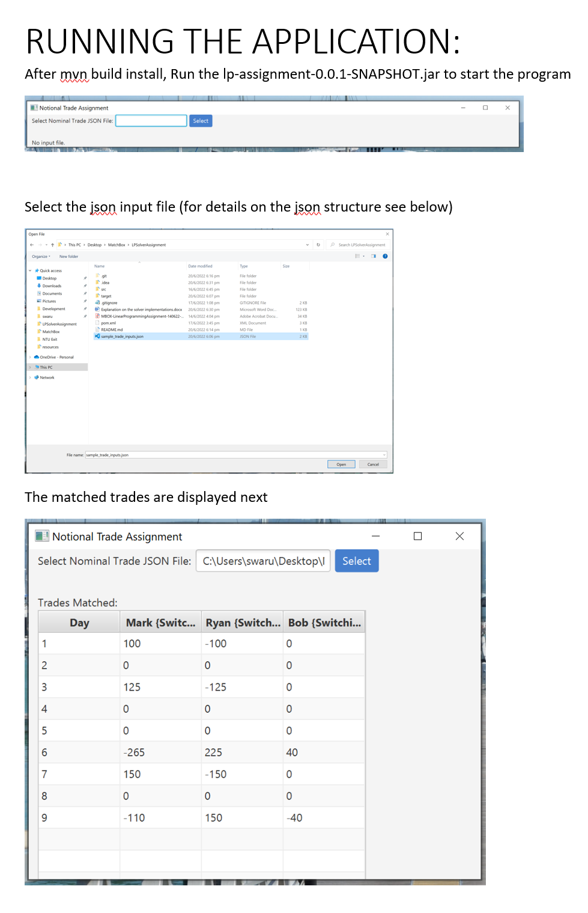

# LPSolverAssignment
Linear programming Assignment
 
## Dependencies
LPSolve
On Windows:
Extract all the files from lp_solve_5.5.2.11_dev_win64.zip into C:\Windows  
Copy lpsolve55.dll and lpsolve55j.dll into C:\Windows   
[download link](https://sourceforge.net/projects/lpsolve/files/lpsolve/)

On Linux: 
Copy the wrapper stub library liblpsolve55j.so to the directory that already contains liblpsolve55.so. Run ldconfig to include the library in the shared libray cache.

Maven
Use IntelliJ idea or any other idea to get the Maven plugin

## Build & RUN
mvn clean install (from the directory that run from the directory that contains pom.xml)
A lp-assignment-0.0.1-SNAPSHOT.jar is built inside the target folder.

## INPUT Format
Input:
The trades input is provided in json format.  A sample_trade_inputs.json file can be found in the root directory for the sample test case. Please create similar json for custom inputs.
[
    {
      "trader": "Mark",
      "max_switching_window": 5,
      "orders": [
        {"day": 1, "notional": 150},
        {"day": 2, "notional": 0},
        {"day": 3, "notional": 200},
        {"day": 4, "notional": -500},
        {"day": 5, "notional": 0},
        {"day": 6, "notional": -500},
        {"day": 7, "notional": 200},
        {"day": 8, "notional": 0},
        {"day": 9, "notional": -300},
        {"day": 10, "notional": 0},
        {"day": 11, "notional": 0}
      ]
    },
    {
      "trader": "Ryan",
      "max_switching_window": 7,
      "orders": [
        {"day": 1, "notional": -100},
        {"day": 2, "notional": 0},
        {"day": 3, "notional": -125},
        {"day": 4, "notional": 500},
        {"day": 5, "notional": 0},
        {"day": 6, "notional": 350},
        {"day": 7, "notional": -150},
        {"day": 8, "notional": 0},
        {"day": 9, "notional": 150},
        {"day": 10, "notional": 0},
        {"day": 11, "notional": 0}
      ]
    },
    {
      "trader": "Bob",
      "max_switching_window": 3,
      "orders": [
        {"day": 1, "notional": 0},
        {"day": 2, "notional": 0},
        {"day": 3, "notional": 0},
        {"day": 4, "notional": 0},
        {"day": 5, "notional": 0},
        {"day": 6, "notional": 80},
        {"day": 7, "notional": 200},
        {"day": 8, "notional": 0},
        {"day": 9, "notional": -40},
        {"day": 10, "notional": 0},
        {"day": 11, "notional": 0}
      ]
    }
]

## License
All rights reserved
